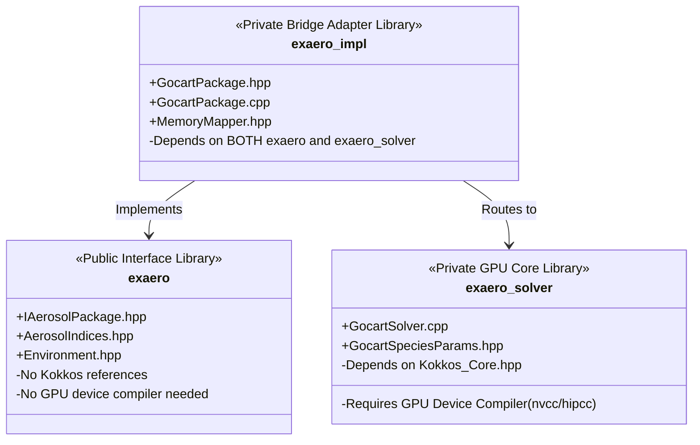

<!-- Generated by doc-superpowers | 2026-07-27 | commit: 1acadf8 -->
# Core Components

This document describes the technical implementation details of EX-aero's core classes, wrappers, memory mappers, and build targets, explaining how the library bridges different programming spaces zero-copy.

---

## 1. Zero-Copy Memory Mapper (`MemoryMapper.hpp`)

The foundational mechanism for zero-copy data routing in EX-aero is the `MemoryMapper.hpp` template. It translates layout-agnostic standard C++20 `exaero_mdspan::mdspan` structures into unmanaged `Kokkos::View` structures.

### Layout Conversions
To ensure exact structural compatibility, `MemoryMapper` maps layout types from `exaero_mdspan` to Kokkos layout counterparts via type traits:

```cpp
template <typename Layout> struct mdspan_to_kokkos_layout;

template <> struct mdspan_to_kokkos_layout<exaero_mdspan::layout_right> {
  using type = Kokkos::LayoutRight;
};

template <> struct mdspan_to_kokkos_layout<exaero_mdspan::layout_left> {
  using type = Kokkos::LayoutLeft;
};
```

### Unmanaged View Creation
`MemoryMapper.hpp` defines template function overloads for multi-dimensional views. These extract the underlying raw pointer (`span.data_handle()`) and dimensions, wrapping them in an unmanaged `Kokkos::View`:

```cpp
template <typename T, typename Layout, typename Accessor>
auto make_unmanaged_kokkos_view(
    exaero_mdspan::mdspan<T, exaero_mdspan::extents<size_t, std::dynamic_extent, std::dynamic_extent>, Layout, Accessor> span) {
  using KokkosLayout = typename mdspan_to_kokkos_layout<Layout>::type;
  using NonConstT = std::remove_const_t<T>;
  using ViewType = std::conditional_t<std::is_const_v<T>, const NonConstT **, NonConstT **>;

  return Kokkos::View<ViewType, KokkosLayout, Kokkos::HostSpace, Kokkos::MemoryTraits<Kokkos::Unmanaged>>(
      const_cast<NonConstT *>(span.data_handle()), span.extent(0), span.extent(1));
}
```

This guarantees:
1.  **Zero Overhead:** No new heap memory is allocated; the memory remains owned and managed by the host application (e.g., Fortran grid buffers).
2.  **Layout preservation:** `layout_left` spans are compiled as column-major Kokkos views, maintaining contiguous cache line access for host memory configurations.

---

## 2. Environmental State View (`IAerosolPackage.hpp`)

Grid environmental conditions are packed into a single, cohesive view struct to streamline parameter passing:

```cpp
struct EnvironmentalStateView {
    View2D<const double> temperature;       // [K] (cell, level)
    View2D<const double> pressure;          // [Pa] (cell, level)
    View2D<const double> air_density;       // [kg/m³] (cell, level)
    View2D<const double> relative_humidity;  // [fraction 0-1] (cell, level)
    View2D<const double> layer_thickness;   // [m] grid layer thickness (cell, level)
};
```

These use `layout_left` mapping so they are ready for direct zero-copy wrapping and parallel GPU processing.

---

## 3. Separation of Build Targets

To enforce the compiler-isolation model, the project's CMake configuration divides the codebase into three distinct compilation targets:



### 1. `exaero` Target (Public Interface)
*   **Role:** Defines the abstract interfaces and C/Fortran bindings.
*   **Compile Settings:** Compiled with C++20 standard compiler. It has absolutely **no Kokkos compilation flags or header search paths**. It installs public interface headers (`IAerosolPackage.hpp`, `AerosolIndices.hpp`, `MemoryMapper.hpp` declarations, `Environment.hpp`).

### 2. `exaero_solver` Target (Private GPU Kernels)
*   **Role:** Compiles the actual GOCART/MAM4 parallel solvers.
*   **Compile Settings:** Compiles with GPU device compilers (such as `nvcc` or `hipcc`) and links against `Kokkos::kokkos`. It has no knowledge of public interface types.

### 3. `exaero_impl` Target (Private Bridge)
*   **Role:** Bridges the public `IAerosolPackage` interface and the private GPU solvers.
*   **Compile Settings:** Compiled using both interfaces, extracts raw pointers via the `MemoryMapper` and schedules parallel work on the GPU via Kokkos executions.
