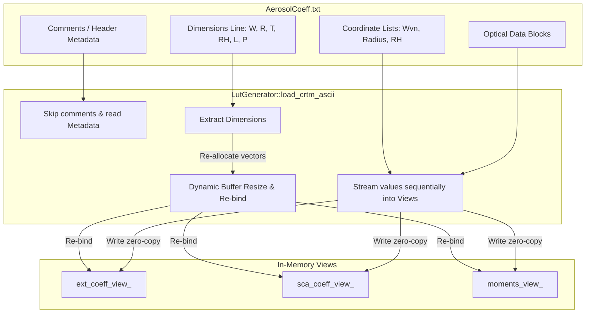

<!-- Generated by doc-superpowers | 2026-07-27 | commit: 1acadf8 -->
# SPEC-CRTM-004: EX-aero CRTM ASCII LUT Parser

**Date:** 2026-07-27  
**Status:** Approved Spec  
**Author:** principal core architect, NOAA NWS Office of Modeling and Development (OMD)

---

## 1. Executive Summary

This specification defines the architectural design for the **EX-aero CRTM ASCII LUT Parser**. It adds native, high-performance C++ stream-parsing capabilities to `LutGenerator` to read standard JCSDA CRTM (Community Radiative Transfer Model) ASCII aerosol coefficient lookup tables (LUTs) directly inside the compiled C++ library.

This allows scientists and host models (CCPP, CATChem) to load legacy or official CRTM coefficient files, dynamically re-dimension EX-aero's internal double-precision buffers, and route the optical parameters (extinction, scattering, and phase function moments) performance-portably or export them cleanly to GOCART YAML formats.

---

## 2. Requirements & Scope

*   **Functional Requirements:**
    *   **Native Stream Parsing:** Parse whitespace-separated scientific floating-point text tables dynamically using C++ standard libraries (`std::ifstream`), without requiring external libraries (like NetCDF).
    *   **Dynamic Re-dimensioning:** Extract the 6 key coordinate dimensions from the file, dynamically resizing the internal `ext_data_`, `sca_data_`, and `moments_data_` vectors and re-binding our layout-left `View3D`/`View4D` views in-place.
    *   **Comment & Blank Line Skipping:** Safely ignore comment lines starting with standard markers (`#` or `!`) and blank lines anywhere in the file.
    *   **Scientific Number Support:** Parse multiple floating-point exponential representations (such as `0.1234E-01`, `0.9876d+00`, or `1.0e-5`) with full double-precision accuracy.
*   **Non-Functional Requirements:**
    *   **Zero-Copy Memory Mapping:** Ensure that parsed tables are mapped directly into standard `layout_left` views, matching our public API interop design.
    *   **Robust Exception Safety:** Guard against malformed headers, negative dimensions, or truncated datasets, throwing descriptive C++ exceptions.

---

## 3. Technical Design



### 3.1. Public C++ Class Interface Extension (`LutGenerator.hpp`)

We extend `exaero::LutGenerator` to declare:
```cpp
namespace exaero {

    class LutGenerator {
    public:
        // ... existing properties and methods ...

        // Parses a CRTM ASCII Aerosol Coefficient LUT file dynamically
        void load_crtm_ascii(const std::string& filepath);
    };

} // namespace exaero
```

---

## 4. CRTM ASCII Format Specification

The parser expects the ASCII file to follow this canonical structure:

```text
# --- Header / Comments are skipped ---
! Release and Version
3 4
"GOCART Aerosol Coefficients"
# --- Dimensions Line ---
61 36 8 36 17 1                   # Dimensions (Wavelengths, Radii, Types, RH, Legendre, Phase)
# --- Coordinates Grid ---
0.30 0.35 0.40 ...                # Wavelength array (microns)
0.05 0.10 0.15 ...                # Radius array (microns)
0 10 20 30 ...                    # RH array (percentage)
1 2 3 4 5 6 7 8                   # Type IDs
# --- Extinction Coefficients Table ---
0.1234E-01 0.1235E-01 ...         # Value blocks for (RH, Wavelength, Type)
# --- Scattering / SSA Table ---
0.9876E+00 0.9875E+00 ...
# --- Phase Legendre Moments Table ---
0.1000E+01 0.9500E+00 ...         # Value blocks for (RH, Wavelength, Type, Moment)
```

---

## 5. Parser Implementation Logic

The C++ parser implements the following sequential steps inside `LutGenerator::load_crtm_ascii`:

### 5.1. File Stream Initialization
Open the file stream securely:
```cpp
std::ifstream file(filepath);
if (!file.is_open()) {
    throw std::runtime_error("EX-aero Error: Failed to open CRTM ASCII file: " + filepath);
}
```

### 5.2. Skip Comments & Read Dimensions
Implement a loop to skip comments and extract dimensions:
```cpp
std::string line;
while (std::getline(file, line)) {
    // Skip empty lines or comments
    if (line.empty() || line[0] == '#' || line[0] == '!') continue;
    
    // Parse dimensions: W, R, T, RH, L, P
    std::stringstream ss(line);
    int n_wave = 0, n_radii = 0, n_types = 0, n_rh = 0, n_legendre = 0, n_phase = 0;
    if (ss >> n_wave >> n_radii >> n_types >> n_rh >> n_legendre >> n_phase) {
        if (n_wave <= 0 || n_types <= 0 || n_rh <= 0 || n_legendre <= 0) {
            throw std::runtime_error("EX-aero Error: Invalid dimensions found in CRTM ASCII file");
        }
        num_rh_ = n_rh;
        num_bands_ = n_wave;
        num_species_ = n_types;
        num_moments_ = n_legendre;
        break;
    }
}
```

### 5.3. Dynamic Re-Allocation
Once the new dimensions are successfully read, the internal vector buffers are resized in-place, and the `mdspan` views are reconstructed to map the newly allocated pointers:
```cpp
ext_data_.resize(num_rh_ * num_bands_ * num_species_, 0.0);
sca_data_.resize(num_rh_ * num_bands_ * num_species_, 0.0);
moments_data_.resize(num_rh_ * num_bands_ * num_species_ * num_moments_, 0.0);

ext_coeff_view_ = View3D<double>(ext_data_.data(), num_rh_, num_bands_, num_species_);
sca_coeff_view_ = View3D<double>(sca_data_.data(), num_rh_, num_bands_, num_species_);
moments_view_ = View4D<double>(moments_data_.data(), num_rh_, num_bands_, num_species_, num_moments_);
```

### 5.4. Floating-Point Stream Traversal
Coordinates are parsed and loaded first. Next, the optical data values are read sequentially using stream operators:
```cpp
// Traversing Extinction values sequentially into the layout-left View3D
for (int i_type = 0; i_type < num_species_; ++i_type) {
    for (int i_wave = 0; i_wave < num_bands_; ++i_wave) {
        for (int i_rh = 0; i_rh < num_rh_; ++i_rh) {
            double val = 0.0;
            if (!(file >> val)) {
                throw std::runtime_error("EX-aero Error: Truncated or malformed Extinction table in CRTM file");
            }
            ext_coeff_view_(i_rh, i_wave, i_type) = val;
        }
    }
}
```
*Note:* The nested loops are ordered `(type, wavelength, RH)` to match the exact canonical indexing stride of CRTM files, guaranteeing correct memory mapping.

---

## 6. Verification & Validation Plan

### 6.1. Unit Tests
*   **Dimensions Validation Test:** Verifies that trying to parse a file with negative, null, or extreme dimensions throws an explicit, descriptive C++ exception instead of causing memory faults.
*   **Comment-Skipping Verification:** Ensures that any lines starting with comment markers (`#` or `!`) or completely empty lines are ignored cleanly.
*   **Float Formatting Compatibility:** Asserts that scientific exponential floats (such as `0.1234E-01` or `0.9876d+00` from Fortran outputs) are parsed with complete double-precision accuracy.

### 6.2. Layout Mapping Integrity
*   Verify that values loaded from a mock CRTM ASCII file match our views' dynamic index accessors (`view(rh, band, species)`) exactly, proving that row/column stride alignments are fully correct.
