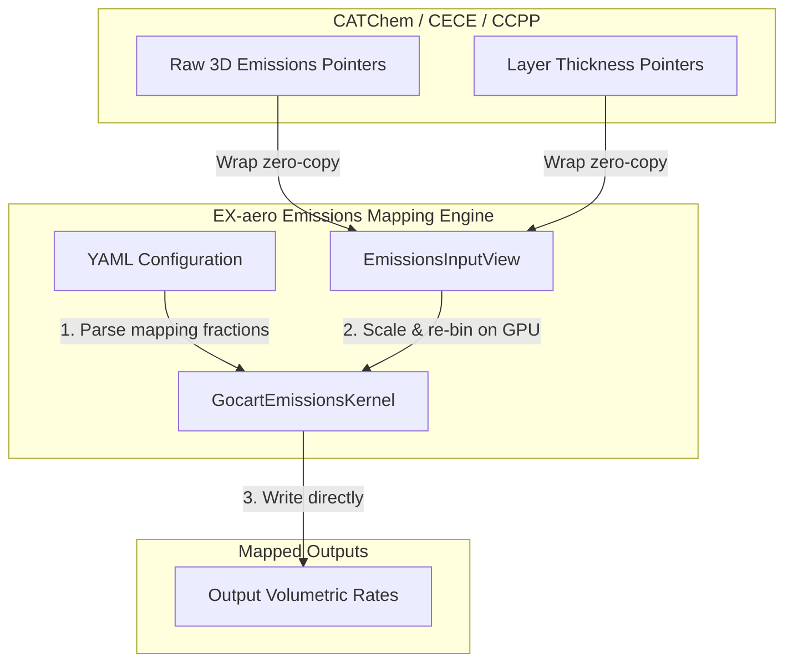

<!-- Generated by doc-superpowers | 2026-07-27 | commit: 1acadf8 -->
# SPEC-EMISSIONS-002: EX-aero Emissions Mapping Engine

**Date:** 2026-07-27  
**Status:** Approved Draft  
**Author:** principal core architect, NOAA NWS Office of Modeling and Development (OMD)

---

## 1. Executive Summary

This specification defines the architectural design for the **EX-aero Emissions Mapping Engine**. It provides a lightweight, GPU-accelerated, and stateless translation library to bridge generic emission processors (such as the Community Emissions Computing Engine—**CECE**) with diverse aerosol microphysics solvers (such as GOCART or MAM4xx).

Instead of hardcoding species mappings or vertical injection schemes directly in Fortran source files, the Emissions Mapping Engine dynamically reads fractional overlap matrices, modal parameter dimensions, and unit definitions from a YAML file at runtime, executing the calculations performance-portably on GPUs via Kokkos.

---

## 2. Requirements & Scope

*   **Functional Requirements:**
    *   **Unified 3D Representation:** Support 3D grid emissions throughout the column `(grid_cells, vertical_levels, species)` to handle surface, elevated, volcanic, or aviation injections.
    *   **Flexible Unit Mapping:** Support both mass concentration rates ($\text{kg/m}^3/\text{s}$) and area-specific fluxes ($\text{kg/m}^2/\text{s}$), dynamically distributing the latter vertically using vertical grid cell thickness $\Delta z$.
    *   **Dynamic Mapping and Re-binning:** Apply a fractional overlap matrix configured via YAML to map generic CECE species to target aerosol bins.
    *   **Modal Mass-to-Number Conversion:** Automatically calculate emitted number fluxes from mass fluxes for modal packages using lognormal distribution statistics.
    *   **CCPP Compliance:** Implement standard error handling parameters (`errmsg`, `errflg`) matching Common Community Physics Package standards.
*   **Non-Functional Requirements:**
    *   **Statelessness:** The engine must be a stateless physical transformer, writing mapped rates zero-copy to a host-managed output view (`emissions_out`) rather than directly modifying the internal aerosol state.
    *   **Zero-Copy Execution:** Pointers from C/Fortran host systems must be mapped to Kokkos views zero-copy, incurring $< 0.1\%$ translation overhead.

---

## 3. Technical Design



### 3.1. Public C++ Boundary Interfaces (`IAerosolPackage.hpp`)

```cpp
namespace exaero {

    enum class FluxType {
        MASS_CONCENTRATION_RATE,  // [kg/m³/s] (Direct volumetric injection)
        AREA_FLUX                 // [kg/m²/s] (Surface/area flux to be vertically distributed)
    };

    struct EmissionsInputView {
        View3D<const double> flux; // (cell, level, raw_cece_species)
        FluxType flux_type;        // Enumeration describing input units
    };

    // Mapped emissions output view
    using EmissionsOutputView = View3D<double>;
}
```

We extend the abstract class `exaero::IAerosolPackage` to include:
```cpp
// Maps raw incoming emissions to package-specific mass and number emission rates
virtual void computeEmissions(
    const EnvironmentalStateView& env,
    const EmissionsInputView& emissions_in,
    EmissionsOutputView& emissions_out) = 0;
```

---

## 4. Mathematical Formulations & GPU Solver Logic

A new parallel GPU kernel `GocartEmissionsKernel` is executed on the default memory space, performing the following calculations in parallel for each grid cell $i$, vertical level $k$, and target species $j$:

### 4.1. Unit Conversions & Scaling
If `flux_type == FluxType::AREA_FLUX`, the area flux is divided by the vertical layer thickness $\Delta z$ from `env.layer_thickness(i, k)` in-place:
$$F_{\text{vol}}(i, k, s) = \frac{F_{in}(i, k, s)}{\Delta z(i, k)} \quad [\text{kg/m}^3/\text{s}]$$

Else, if `flux_type == FluxType::MASS_CONCENTRATION_RATE`, no scaling is required:
$$F_{\text{vol}}(i, k, s) = F_{in}(i, k, s) \quad [\text{kg/m}^3/\text{s}]$$

### 4.2. Fractional Mapping & Overlap Matrix
Target species mass flux is summed from mapped fractions:
$$\text{MassFlux}_{\text{target}}(j) = \sum_s F_{\text{vol}}(i, k, s) \cdot \text{fraction}(s, j)$$

### 4.3. Modal Mass-to-Number Conversions
If target species $j$ represents a lognormal modal number concentration (e.g., in MAM4xx), the Emitted Number Flux ($N_{\text{flux}}$) is derived from its associated mass flux using characteristic emitted particle volume:
$$N_{\text{flux}}(j) \ [\text{particles/m}^3/\text{s}] = \frac{\text{MassFlux}_{\text{target}}(j_{\text{mass}})}{\frac{\pi}{6} \rho_{\text{dry}} D_{\text{emit}}^3 \exp\left(4.5 \ln^2 \sigma_g\right)}$$

Where:
*   $\rho_{\text{dry}}$ is the species dry density [$\text{kg/m}^3$] loaded from YAML.
*   $D_{\text{emit}}$ is the characteristic emitted particle diameter [$\text{m}$] loaded from YAML.
*   $\sigma_g$ is the geometric standard deviation ($\text{GSD}$) loaded from YAML.

---

## 5. C & Fortran Binding Interfaces

```cpp
// C-Linkage wrapper (IAerosolPackage_C.h)
void exaero_compute_emissions(
    exaero_package_t pkg,
    int num_cells, int num_levels, int num_raw_species, int num_target_species,
    int flux_type_code, // 0 for MASS_CONCENTRATION_RATE, 1 for AREA_FLUX
    const double* thick_ptr,
    const double* raw_emissions_ptr,
    double* target_emissions_out_ptr,
    char* errmsg, int* errflg
);
```

```fortran
! Fortran ISO_C_BINDINGS interface (exaero_interface.f90)
subroutine exaero_compute_emissions(pkg, num_cells, num_levels, num_raw, num_target, &
    flux_type_code, thick_ptr, raw_emissions_ptr, target_emissions_out_ptr, &
    errmsg, errflg) bind(c, name="exaero_compute_emissions")
  import :: exaero_package_t, c_int, c_double, c_char
  type(exaero_package_t), value :: pkg
  integer(c_int), value :: num_cells, num_levels, num_raw, num_target, flux_type_code
  real(c_double), intent(in) :: thick_ptr(*), raw_emissions_ptr(*)
  real(c_double), intent(out) :: target_emissions_out_ptr(*)
  character(kind=c_char), intent(out) :: errmsg(*)
  integer(c_int), intent(out) :: errflg
end subroutine exaero_compute_emissions
```

---

## 6. Verification & Testing Plan

### 6.1. Unit Tests
*   **YAML Mapping Parser Test:** Confirms the YAML reader correctly loads and registers fractional maps and modal conversion parameters.
*   **Emissions Unit Test (Mass Conversion):** Verifies that area-flux values ($\text{kg/m}^2/\text{s}$) are divided correctly by $\Delta z$ and mapped to target species.
*   **Modal Number Conversion Test:** Asserts that modal number emissions scale monotonically with mass flux and match analytical lognormal emission volume calculations.

### 6.2. Operational & Fuzzer Resilience
*   **NaN & Inf Clamping:** Ensures that any quiet NaNs, Infinities, or negative values passed in the `raw_emissions_ptr` are clamped defensively to $0.0$ on input boundaries.
*   **Layer Thickness Safeguards:** Ensures that if $\Delta z(i, k) \le 0.0$ or approaches subnormal levels, the engine clamps it or aborts gracefully rather than triggering a division-by-zero or floating-point exception on the GPU.
