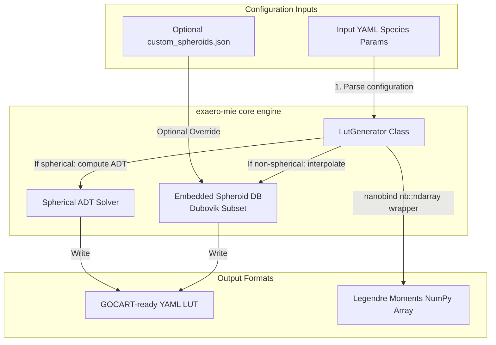

<!-- Generated by doc-superpowers | 2026-07-27 | commit: 1acadf8 -->
# SPEC-MIE-003: EX-aero Mie/ADT Spheroid LUT Generator Utility

**Date:** 2026-07-27  
**Status:** Approved Spec  
**Author:** principal core architect, NOAA NWS Office of Modeling and Development (OMD)

---

## 1. Executive Summary

This specification defines the architectural design for the **EX-aero Mie/ADT Spheroid LUT Generator Utility** (`exaero-mie`). It provides a lightweight, exascale-portable, and highly optimized alternative to `GEOSmie`, designed to generate GOCART-ready YAML lookup tables (LUTs) and polarized phase function moments directly compatible with **VLIDORT** and **JEDI CRTM**.

By combining GPU-accelerated analytical Anomalous Diffraction Theory (ADT) for spherical particles with a compressed, embedded spheroid kernel database (sourced from Oleg Dubovik's standard AERONET database) for non-spherical dust and ash, `exaero-mie` delivers scientific rigor at exascale speeds. A native **`nanobind`** Python interface maps computed multidimensional arrays directly to zero-copy NumPy arrays for seamless data-science workflows.

---

## 2. Requirements & Scope

*   **Functional Requirements:**
    *   **Spherical ADT Mie Solver:** Compute spherical extinction/scattering efficiencies on-the-fly on GPUs via Kokkos-portable math.
    *   **Non-Spherical Spheroid Mapping:** Map non-spherical species to aspect-ratio grids using Dubovik spheroid kernels.
    *   **Phase Function expansion:** Calculate and output Legendre expansion coefficients ($P_l$) up to moment 16 for polarized multiple-scattering compatibility (CRTM/VLIDORT).
    *   **YAML Generation Output:** Format outputs directly into standard GOCART YAML schemas (`rh_lookup_ext`, `rh_lookup_ssa`, `rh_lookup_asym`).
    *   **External Database Override:** Support loading custom JSON spheroid kernels at runtime without C++ recompilation.
*   **Non-Functional Requirements:**
    *   **Zero-Copy Python interop:** Expose `nanobind` bindings returning computed 2D, 3D, and 4D views directly as standard, zero-copy NumPy arrays (`nb::ndarray`).
    *   **Lightweight Embedded Footprint:** Compress the default embedded mineral dust spheroid lookup grid to under 100 KB to retain a header-only compiled dependency model.

---

## 3. Technical Design



### 3.1. Public C++ Class Interface (`exaero_mie.hpp`)

```cpp
#pragma once
#include <exaero/IAerosolPackage.hpp>
#include <string>
#include <vector>

namespace exaero {

    class LutGenerator {
    private:
        int num_rh_ = 0;
        int num_bands_ = 0;
        int num_species_ = 0;
        int num_moments_ = 16;

        std::vector<double> rh_bins_;
        std::vector<double> wavelengths_;
        
        // Multi-dimensional output buffers
        View3D<double> ext_coeff_view_; // (rh, band, species)
        View3D<double> sca_coeff_view_; // (rh, band, species)
        View4D<double> moments_view_;   // (rh, band, species, moment)

    public:
        LutGenerator(const std::string& config_yaml);
        ~LutGenerator() = default;

        // Executes single-scattering Mie/Spheroid computations
        void generate(const std::string& custom_spheroid_json_path = "");

        // Expose outputs for nanobind zero-copy NumPy mapping
        const View3D<double>& ext_coeff_view() const { return ext_coeff_view_; }
        const View3D<double>& sca_coeff_view() const { return sca_coeff_view_; }
        const View4D<double>& moments_view() const { return moments_view_; }

        int num_rh() const { return num_rh_; }
        int num_bands() const { return num_bands_; }
        int num_species() const { return num_species_; }
        int num_moments() const { return num_moments_; }
        
        // Export to standard GOCART-ready YAML format
        std::string to_yaml() const;
    };

} // namespace exaero
```

---

## 4. Python nanobind Binding Interface (`exaero_mie` module)

We will compile C++ binding definitions using `nanobind` to map multidimensional Kokkos layout-left views directly to Python-native NumPy arrays (`nb::ndarray`) zero-copy, zero-allocation:

```cpp
#include <nanobind/nanobind.h>
#include <nanobind/ndarray.h>
#include <exaero_mie.hpp>

namespace nb = nanobind;

NB_MODULE(exaero_mie, m) {
    m.doc() = "EX-aero performance-portable Mie and Spheroid single-scattering LUT generator";

    nb::class_<exaero::LutGenerator>(m, "LutGenerator")
        .def(nb::init<const std::string&>(), nb::arg("config_yaml"))
        .def("generate", &exaero::LutGenerator::generate, 
             nb::arg("spheroid_json_path") = "")
        .def("to_yaml", &exaero::LutGenerator::to_yaml)
        
        // NumPy mapping property readouts (zero-copy)
        .def_property_readonly("extinction_coeff", [](const exaero::LutGenerator& g) {
            return nb::ndarray<double, nb::numpy, nb::shape<-1, -1, -1>>(
                const_cast<double*>(g.ext_coeff_view().data_handle()),
                {g.num_rh(), g.num_bands(), g.num_species()},
                nb::handle()
            );
        })
        .def_property_readonly("scattering_coeff", [](const exaero::LutGenerator& g) {
            return nb::ndarray<double, nb::numpy, nb::shape<-1, -1, -1>>(
                const_cast<double*>(g.sca_coeff_view().data_handle()),
                {g.num_rh(), g.num_bands(), g.num_species()},
                nb::handle()
            );
        })
        .def_property_readonly("legendre_moments", [](const LutGenerator& g) {
            return nb::ndarray<double, nb::numpy, nb::shape<-1, -1, -1, -1>>(
                const_cast<double*>(g.moments_view().data_handle()),
                {g.num_rh(), g.num_bands(), g.num_species(), g.num_moments()},
                nb::handle()
            );
        });
}
```

---

## 5. Verification & Testing Plan

### 5.1. Mathematical & Structural Tests
*   **Legendre Moment Orthogonality Test:** Verifies that phase function Legendre expansion coefficients ($\varpi_l$) accurately reconstruct standard Mie phase functions and satisfy mathematical orthogonality properties:
    $$\int_{-1}^1 P_l(x) P_k(x) dx = \frac{2}{2l+1} \delta_{lk}$$
*   **Spheroid Convergence Test:** Asserts that when `non_spherical = false` or `aspect_ratio = 1.0` (spherical limit), the spheroid interpolation database yields results converging exactly to the analytical spherical ADT Mie calculations.

### 5.2. Boundary & Overflow Protections
*   **Extreme Size Parameter Clamping:** Verifies that size parameters $x = \frac{\pi D}{\lambda}$ that go beyond Dubovik's grid limit ($x > 625$) are safely clamped on the boundary, preventing division-by-zero or memory segmentation faults.
*   **Invalid Spheroid File Fallback:** Confirms that if an invalid or corrupted custom JSON path is provided to `generate`, the system handles the exception safely, logs a warning, and falls back to the embedded standard Dubovik database.
